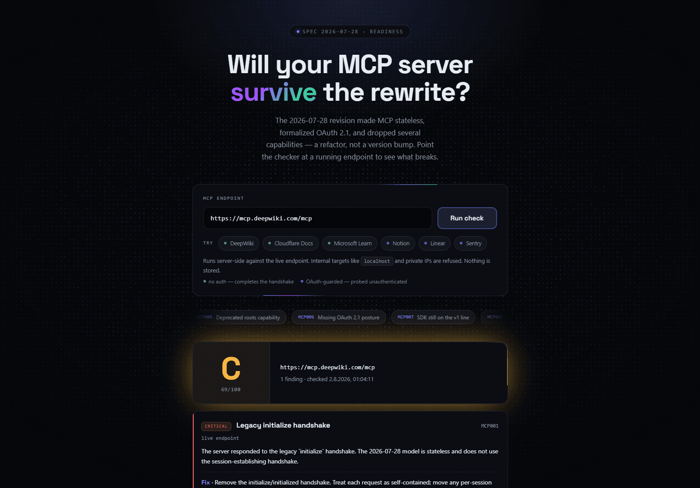

# mcp-migration-check

[](https://github.com/AlpayC/mcp-migration-check/actions/workflows/ci.yml)
[](https://github.com/AlpayC/mcp-migration-check/releases/latest)
[](https://www.npmjs.com/package/mcp-migration-check)
[](https://mcp-migration-check.alpaycelik.workers.dev)
[](./LICENSE)

**Will your MCP server survive the 2026-07-28 rewrite?**

> **[Try it → mcp-migration-check.alpaycelik.workers.dev](https://mcp-migration-check.alpaycelik.workers.dev)**
> Paste an MCP endpoint, get a graded report. Nothing to install, nothing stored.

**[State of MCP migration — 2026-08-23](./reports/ecosystem-2026-08-23.md)** —
13,380 unique remote endpoints from the official registry probed; 10,890
returned enough protocol or authentication signal to grade. **60.1% serve the
legacy protocol only.** A further 5.5% are dual-era — current *and* still
answering the old handshake, which the revision permits and this report does
not count against them. An earlier version of this snapshot could not tell
those two apart; see [the postmortem](#mcp001-told-servers-to-break-their-own-users).

[](https://mcp-migration-check.alpaycelik.workers.dev)

The [Model Context Protocol](https://modelcontextprotocol.io) revision dated
**2026-07-28** is the largest breaking change in the protocol's history: it
makes the transport **stateless**, formalizes **OAuth 2.1** for remote servers,
and **deprecates** several capabilities. Migrating is a refactor, not a version
bump — and a large share of the thousands of public servers aren't actively
maintained.

`mcp-migration-check` is a small, **deterministic** readiness checker. It points
at a running MCP endpoint (or scans a repo) and reports, with a letter grade and
per-finding fixes, exactly what breaks. No LLM, no API key, nothing stored.

It ships as four surfaces over one core:

| Surface           | Use it to…                                                |
| ----------------- | --------------------------------------------------------- |
| **Web demo**      | paste a URL, get a graded report — nothing to install      |
| **CLI**           | `npx mcp-migration-check <url>` — one command, no install  |
| **GitHub Action** | keep a server from regressing, with a grade on every PR    |
| **Skill**         | hand an agent the diagnosis *and* the migration procedure  |

The split is deliberate. The demo and the CLI see a server from the outside and
answer *"am I broken?"*. The Action asks that question again on every commit.
The skill sees the code and answers *"fix it"* — which is the part that actually
takes a week.

---

## Quick start

### Web demo

Hosted at
**[mcp-migration-check.alpaycelik.workers.dev](https://mcp-migration-check.alpaycelik.workers.dev)**,
or run it yourself:

```bash
npm install
npm run dev:web   # http://localhost:3000
```

Paste an endpoint and read the graded report. Because the handler fetches a
user-supplied URL server-side, it enforces two things: an **SSRF guard** that
refuses `localhost`, private ranges and the cloud metadata address, and a
**rate limit** of 20 requests per minute per IP via Cloudflare's Workers
binding. See [DEPLOY.md](./DEPLOY.md) for why neither lives where you might
expect.

### CLI

```bash
npx mcp-migration-check https://example.com/mcp   # probe a live endpoint
npx mcp-migration-check --source ./my-server      # scan a repository
npx mcp-migration-check --source . --json         # machine-readable
```

The published package is one generated file and a README, with an empty
dependency tree — the same bundled engine the skill carries. Exit codes are
`0` clean, `1` at least one critical finding, `2` inconclusive, so it works as
a CI gate on its own.

It is an ordinary package on the public registry, so whatever you already use
reaches it — only the run-it-once command differs:

```bash
pnpm dlx mcp-migration-check https://example.com/mcp
yarn dlx mcp-migration-check https://example.com/mcp
bunx mcp-migration-check https://example.com/mcp
```

### GitHub Action

```yaml
- uses: AlpayC/mcp-migration-check@v1
  with:
    source: .          # or: url: https://example.com/mcp
    fail-on: critical  # critical (default) | warning | never
```

It writes a graded table to the job summary and exposes `grade`, `score`,
`critical`, `warnings`, `findings`, `report-path` and `badge-url` as step
outputs. No `setup-node`, no install: the engine ships pre-bundled in the
action. An endpoint that cannot be reached never fails the build — an outage is
not the same claim as an unmigrated server.

**Badges.** The self-updating one is the workflow's own status badge:

```markdown
[](https://github.com/OWNER/REPO/actions/workflows/mcp-check.yml)
```

The `badge-url` output is a shields.io badge carrying the actual letter grade.
It is a snapshot of the run that produced it, so it only stays true if something
writes it back — a README commit, or a gist the badge reads from. Say which one
you mean; a stale `A` is worse than no badge.

### Skill

In Claude Code, install it from this repository:

```
/plugin marketplace add AlpayC/mcp-migration-check
/plugin install mcp-migration@mcp-migration-check
```

Then ask it to migrate a server. `/plugin marketplace update mcp-migration-check`
picks up later changes — the skill is served from the repository rather than
copied out of it, so it cannot go stale against the rules it ships.

Or download **[`mcp-migration.skill`](https://github.com/AlpayC/mcp-migration-check/releases/latest)**
from the latest release and install that. Or build it yourself:

```bash
npm install
npm run pack:skill   # → dist/mcp-migration.skill
```

The skill bundles a dependency-free copy of the rule engine, so the agent's
diagnosis step is deterministic rather than a guess from reading code — and
`references/` carries the per-rule remediation guidance for the part that
follows.

**Not using Claude?** The bundled checker is a single file that needs nothing
but Node, so any agent that can run a shell command — Codex, Cursor, whatever —
can use it directly. Unzip the `.skill` (it is a zip) and run
`scripts/mcpcheck.mjs`, or take it from `skill/mcp-migration/scripts/` in this
repo. `references/remediation.md` is plain Markdown and reads fine on its own.

Run the bundled checker directly if you want:

```bash
node skill/mcp-migration/scripts/mcpcheck.mjs --source ./my-server
node skill/mcp-migration/scripts/mcpcheck.mjs --local http://localhost:3000/mcp
```

---

## What it checks

| Rule   | Severity | Signal                                                              |
| ------ | -------- | ------------------------------------------------------------------- |
| MCP001 | critical | legacy-only: answers `initialize`, serves no modern surface          |
| MCP002 | critical | `Mcp-Session-Id` minted for a *modern* request — the classic hazard  |
| MCP003 | warning  | deprecated `logging` capability                                      |
| MCP004 | warning  | deprecated `sampling` capability                                     |
| MCP005 | warning  | deprecated `roots` capability                                        |
| MCP006 | critical | auth without RFC 9728 protected-resource metadata                    |
| MCP007 | warning  | still on `@modelcontextprotocol/sdk` (the v1 line)                   |
| MCP008 | warning  | modern server that does not implement `server/discover`              |
| MCP009 | warning  | Python `mcp` constrained to 1.x or importing the v1 `FastMCP` API    |
| MCP010 | warning  | Rust MCP crate on a pre-2026-07-28 line (source scan only)            |
| MCP101 | info     | dual-era: current **and** still accepts the legacy handshake         |
| MCP102 | info     | session ids issued to legacy clients only                            |

Live checks observe runtime behavior over HTTP; source scans grep for the same
signals in code. For Python they also inspect `pyproject.toml`, requirements
files, `Pipfile`, and `setup.cfg`, including those in nested projects. Each
finding links the spec or official SDK migration page it derives from.

**Backwards compatibility is not a finding.** The `MCP1xx` rules are
observations and cost zero points. `2026-07-28` says a server that wants to
serve both kinds of client [**MAY** implement both
behaviours](https://modelcontextprotocol.io/specification/2026-07-28/basic/versioning),
picking its semantics from how each request opens — so a server that answers
`initialize` for the v1 clients still in the field is being compatible, not
drifted. The live probe therefore opens as a *modern* client
(`server/discover` with per-request `_meta` and the required
`MCP-Protocol-Version` header) and only then tries the legacy handshake. Only
the absence of the modern surface is a defect.

## Honest limitations

- **These rules are not the whole revision.** The 2026-07-28 changelog also makes
  `server/discover` mandatory, requires a `resultType` on every result, replaces
  the GET stream and `resources/subscribe` with `subscriptions/listen`, removes
  `ping`, `logging/setLevel` and SSE resumability, and requires `Mcp-Method` /
  `Mcp-Name` headers. A server can pass every rule here and still be broken.
  This is a triage tool, not a conformance suite.
- **The source scan is heuristic.** It greps for patterns, so it can miss
  dynamically-built capability names and can over-match inside comments.
  Treat source findings as signals to review, not proof. The live probe is
  more authoritative for runtime behavior; the two complement each other.
- **The web demo only sees the outside.** It probes over HTTP, so it cannot
  reach the SDK rules: MCP007 needs `package.json`, while MCP009 needs Python
  project metadata or source. Use the skill or CLI for repository checks.
- **MCP001 proves absence, which is the weaker claim.** It fires when the
  legacy handshake answers and no modern signal did. A server whose modern
  surface is hidden behind a WAF, a path-based gateway or an unfamiliar-method
  filter lands there wrongly. The dual-era observation cannot fail the same
  way — it needs a positive modern answer to fire at all.
- **SDK dependency checks currently cover TypeScript, Python, and Rust.** Go
  and C# servers still get the language-neutral source signals, but no
  SDK-version finding. Those SDKs moved differently, so do not apply the
  TypeScript or Python migration advice to them.
- **The Rust `Cargo.toml` parser is line-oriented and reads only the root
  manifest.** It does not see workspace member inheritance (`workspace = true`),
  renamed dependencies (`package = "rmcp"`), or target-specific tables. A clean
  MCP010 result means the root manifest is clean — workspace-inherited
  dependencies may still use an older crate version.

## Two rules that were wrong

Worth recording, because it shaped how the rest is verified.

### MCP001 told servers to break their own users

The first version of MCP001 fired on any endpoint that answered `initialize`
and told the maintainer to *"remove the initialize/initialized handshake"*.
Taking that advice would have cut off every v1 client still pointed at the
server, for no compliance gain — because `2026-07-28` never asked for it:

> A server that wishes to support both legacy clients (which expect an
> `initialize` handshake) and modern clients (which use per-request metadata)
> **MAY** implement both behaviors.
> — [Versioning: Backward Compatibility](https://modelcontextprotocol.io/specification/2026-07-28/basic/versioning)

The probe made it worse by only ever speaking as a legacy client: it sent one
`initialize` carrying `protocolVersion: 2025-11-25` and reported the answer as
drift. It never asked the modern question at all, so a dual-era server — the
mark of a *maintained* one — was indistinguishable from an abandoned v1 server.

What changed:

- The probe opens as a modern client (`server/discover` with per-request
  `_meta` and the required headers), falls back to a modern `tools/list`, and
  only then tries the legacy handshake.
- `-32601` is explicitly *not* treated as modern evidence — every JSON-RPC
  server emits it for an unknown method. Only the `-32020…-32099` range the
  spec reserves for itself counts, along with a result carrying `resultType`.
- "Still accepts legacy" (MCP101, info, zero points) is split from "only
  accepts legacy" (MCP001, critical). Only the second is a finding.
- `info` findings now cost nothing, so compatibility cannot pull a grade down.

Pinned by tests, including one asserting MCP001's fix text never says to remove
the handshake.

### MCP007 named a version that never existed

MCP007 originally fired on `@modelcontextprotocol/sdk` below `2.0.0` and told
you to upgrade to `^2` and run "the official v1→v2 codemod". Both halves were
wrong in different ways, and neither was caught by reading the code — only by
checking against npm and the spec:

- `@modelcontextprotocol/sdk` has **never published a 2.x**. It tops out at
  1.30.0. So the fix text named a version that does not resolve.
- v2 exists, but as a **package rename**: `@modelcontextprotocol/server`,
  `/client`, `/core`, `/node` and the HTTP adapters, all published 2026-07-27.
- The codemod is real, and is its own package:
  `npx @modelcontextprotocol/codemod@latest v1-to-v2 .`

The first correction overshot — the rule was deleted outright on the conclusion
that no v2 line existed at all, which is what the package rename makes it look
like from the `sdk` package alone. It was reinstated once the new names turned
up. It now keys on the *presence* of the v1 package rather than a version
threshold, because the package name is the actual signal.

Two tests exist so this cannot come back:

```ts
assert.ok(!/@modelcontextprotocol\/sdk[@^ ]*\^?2/.test(f.fix));  // no phantom 2.x
assert.ok(!rule.specRef.includes("#"));                          // no dead anchor
```

The second one guards a related defect found the same way: every rule's
`specRef` pointed at `…/2026-07-28#lifecycle` and similar, but the spec is split
across subpages and has no such anchors — all seven links silently resolved to
the overview page. They are now verified subpage URLs.

## Architecture

```
.claude-plugin           marketplace manifest — the skill, served from this repo
packages/core            pure, deterministic engine (rules · probe · scan · SSRF guard)
packages/core/test       node:test suite over the engine — no network, no disk
packages/cli             the npm package: nothing but the bundled engine
skill/mcp-migration      SKILL.md + bundled engine + per-rule remediation guide
web                      Next.js demo (App Router) over the same core
action.yml               composite GitHub Action over the bundled engine
scripts/bundle-engine.mjs one esbuild config, two generated copies of the engine
scripts/ecosystem-report.mjs registry-wide readiness snapshot
```

```bash
npm test              # node --test via tsx; 110 assertions, no network
npm run typecheck
npm run build:bundles # regenerate both copies of the engine; CI fails if stale
```

The suite leans on the seams the engine already had: rules are pure functions
over a `RuleContext`, and `probeEndpoint` takes a `fetchImpl`. The SSRF guard
gets the most coverage — it is a security control on a public handler, so each
blocked range is paired with the adjacent address that must still pass.

One core, four consumers — the rules live in exactly one place, and the skill's
and the CLI's copies of the engine are generated, never hand-edited. CI rebuilds
both and fails if either moved.

## Tech

TypeScript · Node 22 · npm workspaces · Next.js 16 (App Router, Turbopack) ·
React 19.2 · Tailwind v4 · Magic UI · Cloudflare Workers via OpenNext.
No runtime LLM. MIT licensed.

## Ecosystem report

```bash
npm run report:ecosystem -- --limit 500 --concurrency 6
```

Pulls the remote endpoints out of the
[official MCP registry](https://registry.modelcontextprotocol.io), probes each
one with the same engine, and writes an aggregate snapshot to `reports/`: how
many endpoints answered, which protocol era each serves, the grade
distribution, and how often each rule fires. `--name-servers` adds a per-server
table.

**Dating the sample.** A dead endpoint that still returns 200 is
indistinguishable from a maintained one that chose not to migrate — unless you
can date it, and the registry skews heavily toward servers listed once and
never touched again. So each row is dated: from the linked GitHub repository's
last push where there is one, and from the registry entry's own `updatedAt`
otherwise. The report cross-tabs protocol era against that date, and restates
the headline over the servers whose code has been touched since the revision
shipped — the ones that *could* have migrated. Set `GITHUB_TOKEN` for it to
cover more than 60 repositories an hour; without one the run dates what it can
and prints the coverage rather than guessing. `--no-dates` skips the pass,
`--active-window <days>` moves the line (default 180).

The two dates are not the same claim and the report says which one each row
rests on: a push is evidence about the code, a registry timestamp only says
when somebody last published an entry.

Two things about it are deliberate.

**The Markdown report counts servers, it does not name them.** A public league
table of broken servers is a different project with a different ethics, and it
would poison the well with exactly the maintainers this tool exists to help.
The JSON alongside it does carry per-target detail, because it is a local file
rather than a publication — which is why `reports/*.json` is gitignored and the
Markdown is not.

**Answering is not the same as being migrated.** `probeEndpoint` sets
`reachable` on any HTTP response, which is right for a checker aimed at one
endpoint you own. Across a few thousand strangers it is not: a 403 from a WAF, a
404 from a moved path and a captive proxy all answer with something that is not
MCP, and scored naively they come back as a clean **A**. A snapshot built on
that would report the exact opposite of the truth. Those land in an
`answered, but showed no MCP behaviour` bucket and stay out of the denominator.

## Contributing

Corrections to rules are the most useful thing you can send — this project has
shipped one that was factually wrong, and the section above exists because of
it. See [CONTRIBUTING.md](./CONTRIBUTING.md) for what a rule change needs, and
[AGENTS.md](./AGENTS.md) for the invariants that CI enforces.

Found a way past the SSRF guard on the hosted demo? That one goes to
[SECURITY.md](./SECURITY.md), not to a public issue.

## License

[MIT](./LICENSE)
